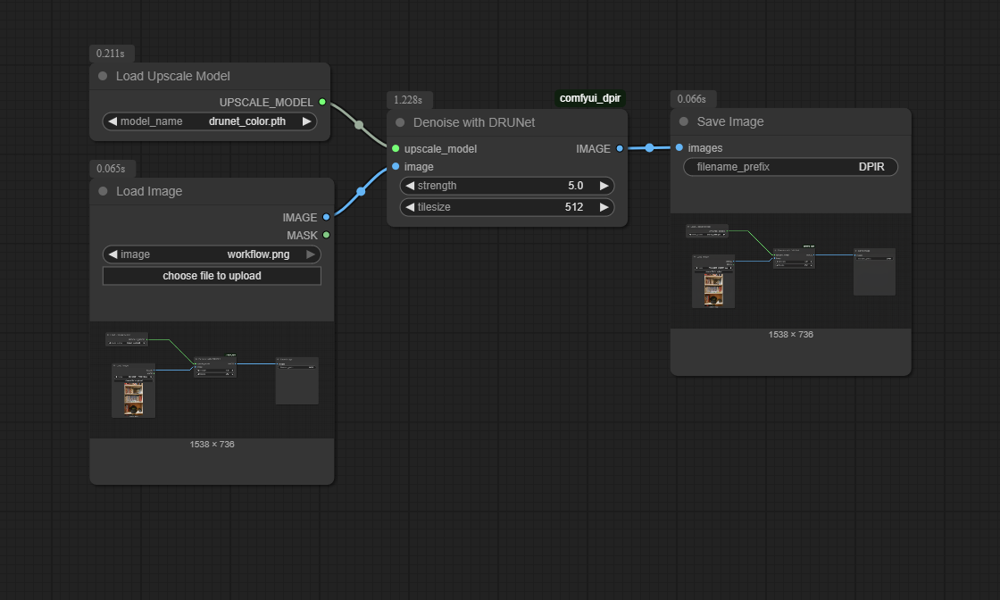

# ComfyUI-DPIR

A dpir/DRUnet inference node for ComfyUI. Runs DRUnet models loaded from the load upscale model node. 
The key difference this node has to the vanilla upscale via model node, is an added strength variable passed to the model, and handling of grayscale images for the DRUnet-gray model.

Works for these models:
drunet_color.pth
drunet_deblocking_color.pth
drunet_deblocking_grayscale.pth
drunet_gray.pth

Models can be found at: https://github.com/cszn/KAIR/releases/tag/v1.0

Sample workflow:

## Installation
Add via manage extensions menu or ComfyUI Manager. Put drunet models manually in ComfyUI/models/upscale_models

or

Download this project as zip and add the unzipped folder to ComfyUI/Custom_nodes. Put drunet models in ComfyUI/models/upscale_models

## Roadmap
Get drunet models into the model manager or something easier.